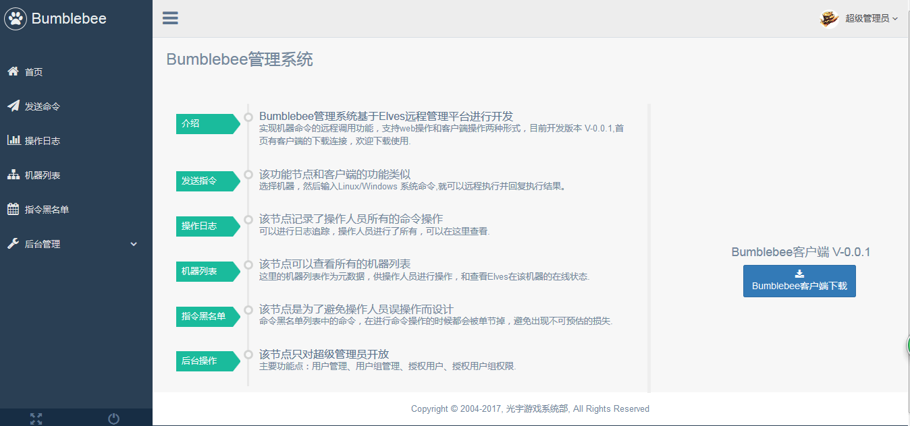
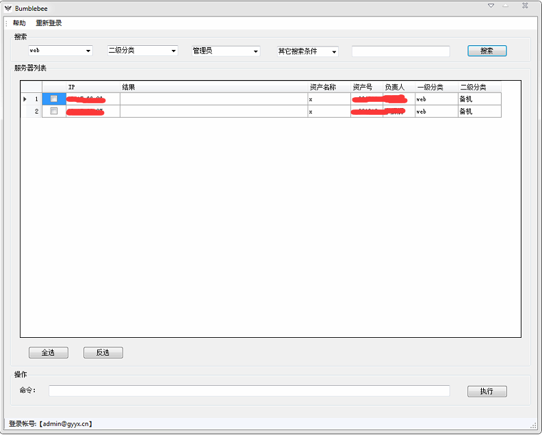
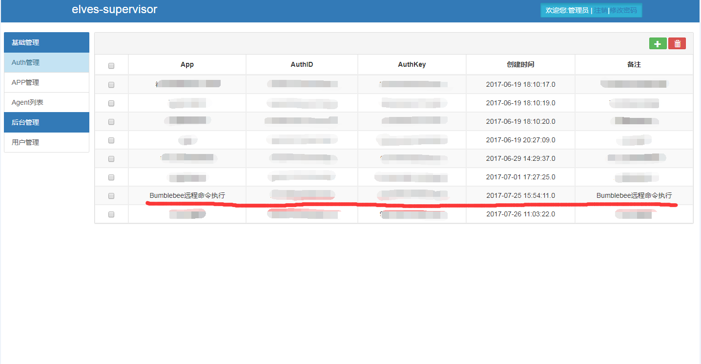
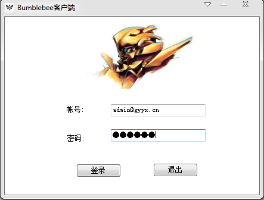
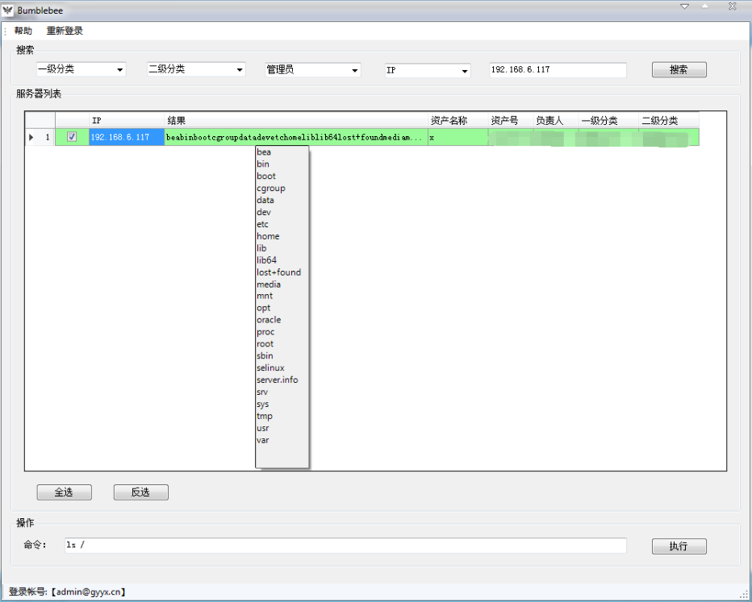

# bumblebee
## 简介
bumblebee(大黄蜂)运维工具：基于Elves开源自动化运维开发平台进行开发，实现的一款远程命令行执行工具（Elves开源自动化运维开发平台地址：[https://github.com/gy-games/elves](https://github.com/gy-games/elves)），bumblebee分为manager、client、script三部分。
	
## manager
Java编写，纯java-web项目，作为管理端和服务端，作为后台管理端可以进行权限分配和为客户端提供接口。

## client
c#编写的一款c/s客户端程序，调用bumblebee-manager提供的接口实现服务器的远程命令执行，并显示结果展示。

## script
python编写，依照Elves-App SDK开发，是Elves-Agent端执行的脚本文件，所有的命令通过Elves调用各个服务器上的脚本，执行并回复结果。

## 特征
- client端命令全部通过manager端作为代理，调用Elves执行并返回数据，并提供命令操作日志
- manager端提供指令黑名单，避免危险命令操作
- manager端同样提供发送命令节点功能
- manager端提供用户授权功能，用户只能操作授权的机器
- manager端提供机器列表界面（可以自定义查询Elves机器在线状态）
- manager端接口调用安全起见，加入签名验证

## 提示
bumblebee运维系统是基于Elves开源自动化运维开发平台进行开发，这套系统的完全依赖Elves来实现，因此在搭建之前，请熟悉了解Elves,欢迎大家的关注和使用~

## 安装与部署
下载源码：git clone https://github.com/gy-games/bumblebee.git

一、bumblebee-script部署：该模块基于 elves-app python sdk开发，只需要打包发布到elves即可。

	cd bumblebee-script
	zip -qj cmd_0.0.1.zip cmd/cmd.py cmd/appcfg.json  cmd/app-worker.py
使用elves-supervisor部署app(cmd_0.0.1.zip)、授权机器、新增密钥。

二、bumblebee-manager部署：标准的Java web项目，使用maven打war包，发布tomcat即可。

	1. bumblebee-manager/db.sql  新建数据库
	2. 配置文件修改:bumblebee-manager/bumblebee-web/src/main/resources/conf.properties，只需要修改database和elves的配置项即可。
	
		#mysql database setting(test)
		jdbc.url=jdbc\:mysql\://127.0.0.1\:3306/db_bumblebee?characterEncoding=UTF-8&amp;useOldAliasMetadataBehavior=true&amp;zeroDateTimeBehavior=convertToNull
		jdbc.username=root
		jdbc.password=root
		
		#elves config
		elves.auth.id=xxxxxxxxx
		elves.auth.key=xxxxxxxxx
		elves.app=cmd
		elves.api.host=http://127.0.0.1
		
	3. maven打包war包，发布到tomcat
	   cd bumblebee-manager
	   mvn clean
	   mvn package
	   cp bumblebee-web/target/bumblebee-web.war ROOT.war

进去bumblebee-manager管理端 新建用户，新建分组，授权机器即可进行操作了。

	注： 
	1.数据库表 bumblebee_agent 中存放的是bumblebee系统的机器列表源数据，需要手动录入
	2.默认帐号：admin@gyyx.cn，密码：123456 , 新增用户初始密码： 123456

三、bumblebee-client部署：客户端已经打包成exe程序，在bumblebee首页即可下载使用，需要修改 Bumblebee客户端.exe.config中服务端的地址：

	<?xml version="1.0"?>
	<configuration>
	  	<appSettings>
	    	<add key="BumblebeeServerHost" value="http://bumblebee.gyyx.cn"/>
	  	</appSettings>
		<startup>
			<supportedRuntime version="v4.0" sku=".NETFramework,Version=v4.6.1"/>
		</startup>
	</configuration>

## License
Licensed under the Apache License, Version 2.0